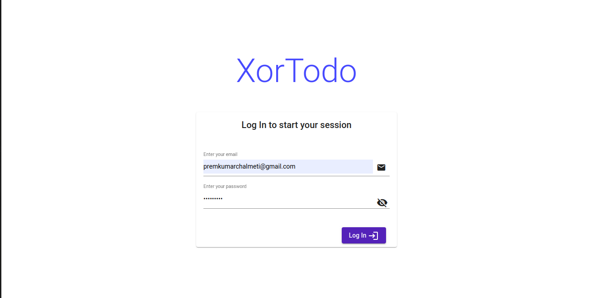
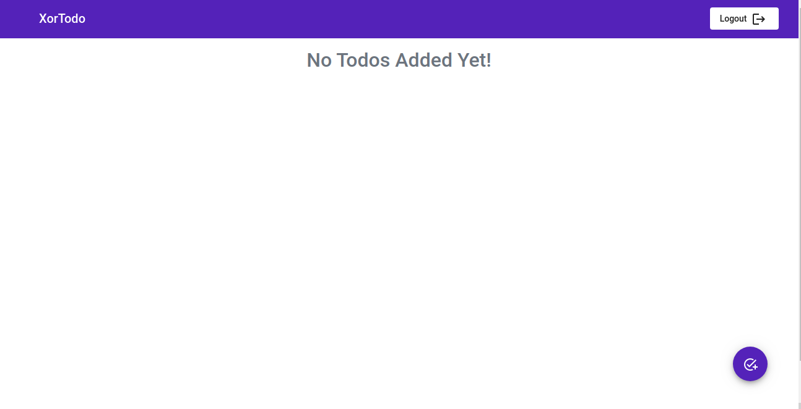
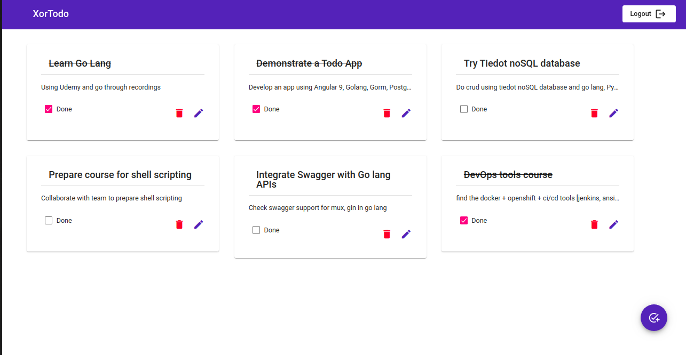
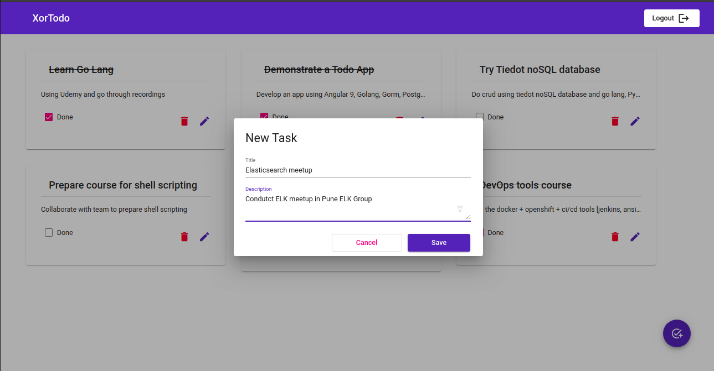
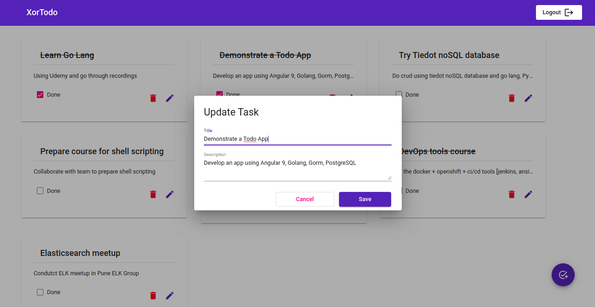

# Task Management App

## Login

## Dashboard

## New Task

## Update Task

### Steps to setup:

Clone this Repo:

1. git clone `<repo_url>`

2. Add your credentials in `configs/db.go` file

3. Start Go Server:

    `go run main.go`

4. Serve Angular app from `web/angular_app` directory:

    `ng serve`
